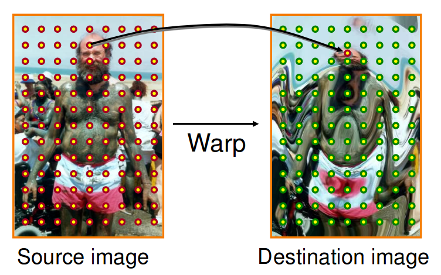
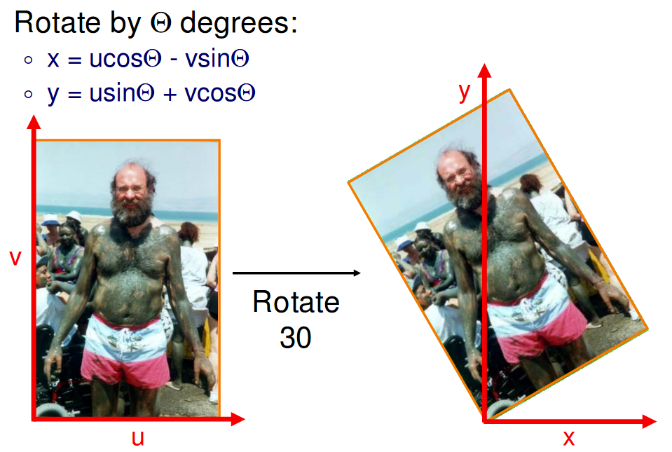
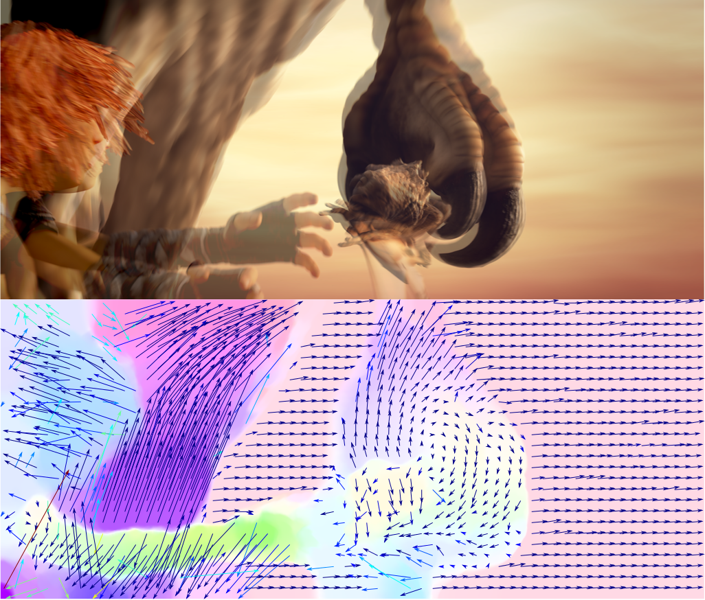
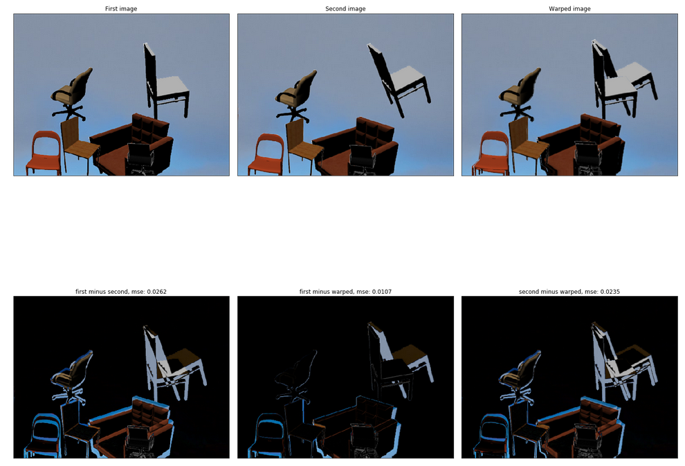

# Image Warping in Tensorflow

## What is image warping?
Taking an input image and a mapping function, the goal is to move every pixel based on this function to get a new (warped) image:

Sometimes this mapping function has a mathematical expression like the following example:

For more details see [this](https://www.cs.princeton.edu/courses/archive/spr11/cos426/notes/cos426_s11_lecture03_warping.pdf)

In the case of **optical flow**, instead of a mathematical expression for mapping, we have motion vector for every pixel that tells us the location of each pixel in the next frame.
Getting these motion vectors, and the image, we can move every pixel and generate a new one. 

[Source] (https://lmb.informatik.uni-freiburg.de/Publications/2015/DB15c/bib_teaser_v2.png)

## What is this repository about?
In this project, I want to write a code in python (using Jupyter notebook) and tensorflow to take one image and optical flow map as input and generate a warped image. 
**But** this is not all of it. I think tensorflow's implementation (`contrib.image.dense_image_warp`) has an assumption on the format of flow map which is not consistent with primary optical flow benchmark datasets. Here I am running tensorflow code on three different examples from different datasets to show that this assumption most probably is not ok. 
Then I will modify the existing code to get correct results.

